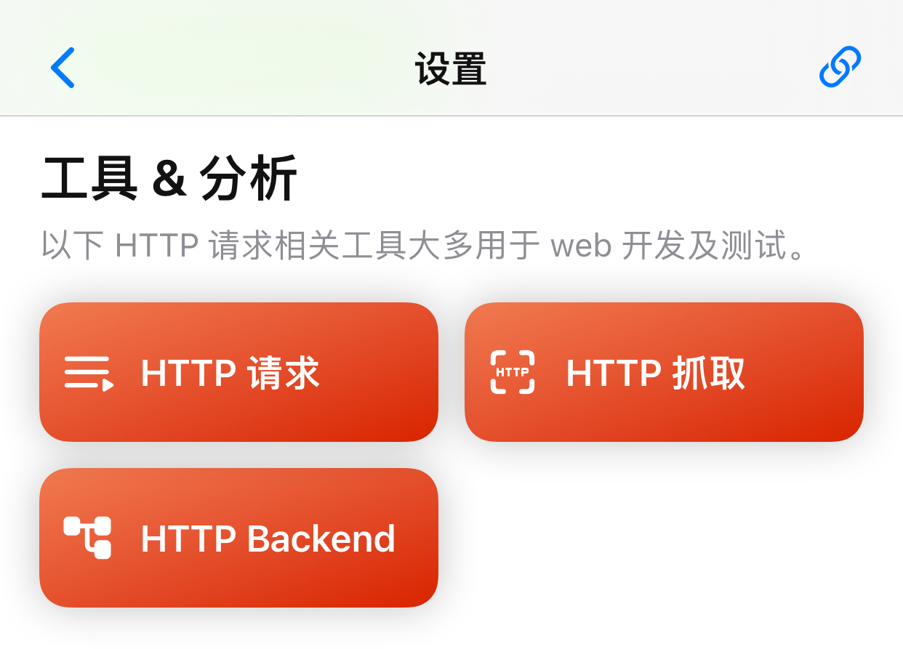
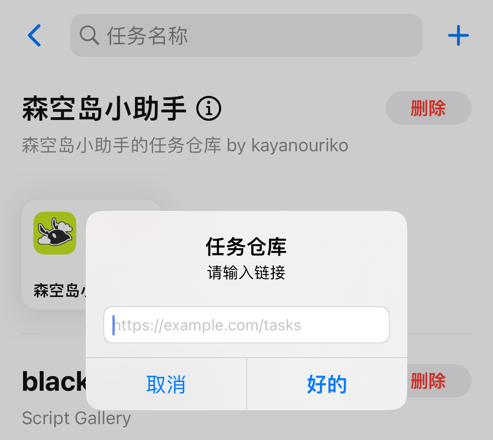
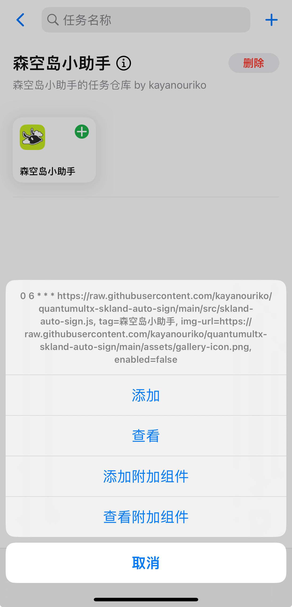
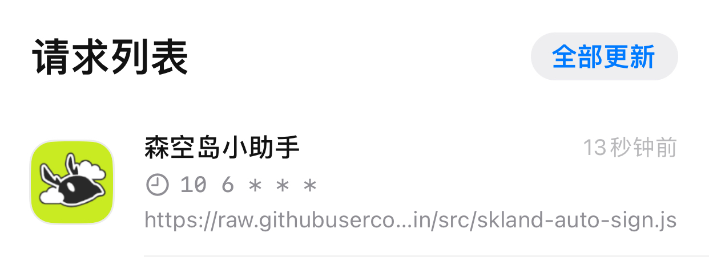
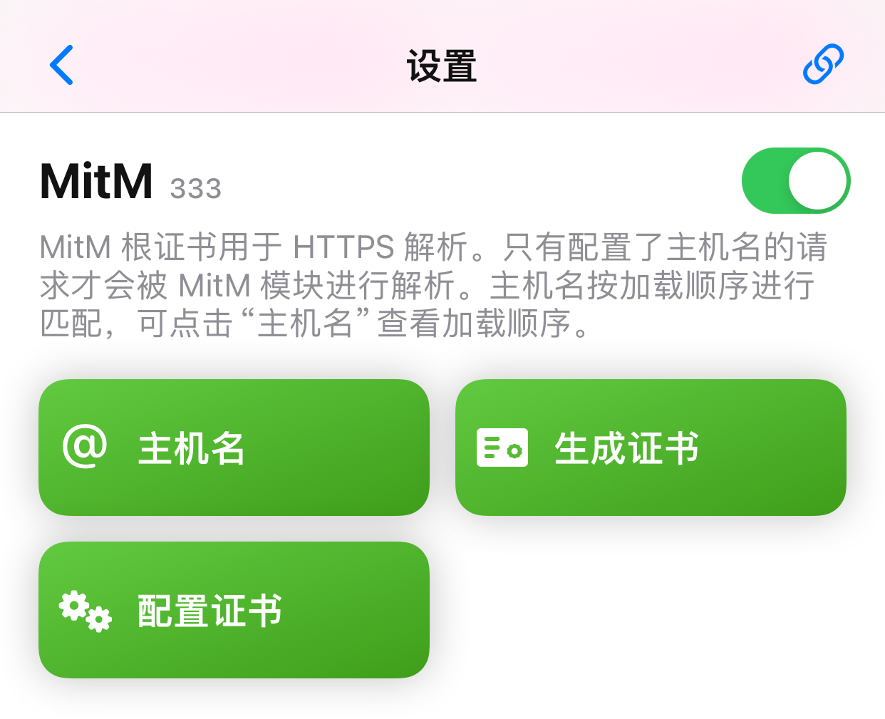
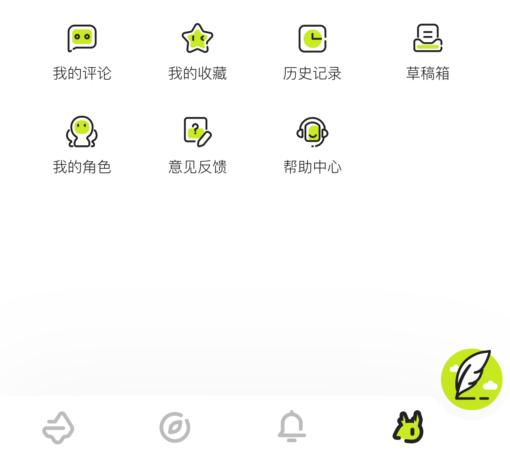

# 森空岛小助手

 

一个 quantumultx 脚本, 主要用于森空岛游戏签到的自动运行.

## 前言

1. 当使用该项目的前提下, 一个手机对应一个账号, 所以不支持多账号的功能是理所应当的. 当你有多账号需求时, 请使用其他相关项目.

2. 使用该项目之前, 你需要提前了解如何使用 quantumultx 拉取远程仓库和执行脚本.

3. 目前 quantumultx 并不会自动升级远程配置的脚本, 当你发现脚本功能不可用时, 可先看该项目是否已经更新修复了, 再尝试在 quantumultx 内更新脚本以获取最新的修复.

## 更新日志

* v1.0.0(20230908)
    1. 初版 🎉


<details>
    <summary>历史更新日志</summary>
暂无信息
</details>

## 如何使用

### 引入资源

|          |
| :------------------------------: |
| 打开应用底部最右侧图标<br>task-1 |

|  |
| :----------------------: |
| 点击 HTTP 请求<br>task-2 |

|                    |
| :----------------------------------------: |
| 点击导航栏最左侧图标进入仓库页面<br>task-3 |

|                |
| :------------------------------------: |
| 点击右上角加号, 输入仓库地址<br>task-4 |

```
// 仓库地址连接
https://raw.githubusercontent.com/kayanouriko/quantumultx-skland-auto-sign/main/task/gallery.json
```

|                                                 |
| :---------------------------------------------------------------------: |
| 点击森空岛小助手, 在弹出的 sheet 中分别选择添加和添加附加组件<br>task-5 |

|  <br>   |
| :-----------------------------------------------------: |
| 请求列表和重写列表如图所示即为添加成功<br>task-6 task-7 |

* 注1: 脚本默认执行时间为每天早上6点整, 你可以根据自己的需求自行修改.

### 获取脚本执行必须参数

|            |
| :--------------------------------: |
| 保证重写列表的为打开状态<br>task-7 |

|          |
| :---------------------------------: |
| 保证MitM功能为打开状态<br>rewrite-1 |

|                                    |
| :-----------------------------------------------------------: |
| 打开森空岛 app, 此时会连续弹出两条获取成功的通知<br>rewrite-2 |

* 注2: 如果之前你的森空岛 app 是处于后台开启状态, 需要清除后台, 重新打开森空岛 app 才能收到获取成功的通知.

|  |
| :-------------------------: |
|  取消打勾操作<br>rewrite-3  |

### 至此, 脚本可以运行了.
